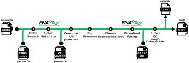
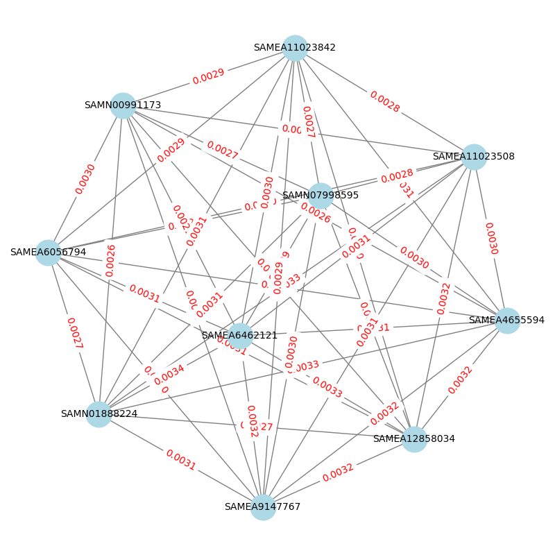
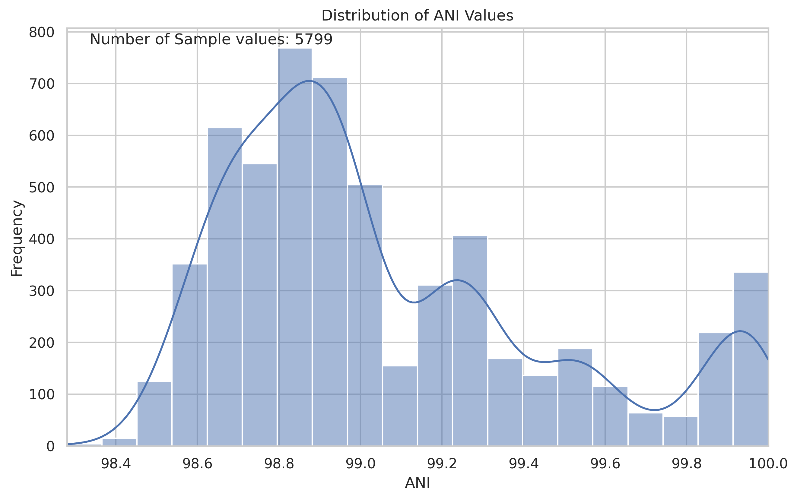

# BinBaDGer 

[](https://www.nextflow.io/)
[](https://www.docker.com/)
[](https://sylabs.io/docs/)

BinBaDGer (**Bin**ned **Ba**cterial **D**ataset **Ge**nerato**r**) is a Nextflow pipeline that generates a dataset of genomes from [AllTheBacteria](https://allthebacteria.readthedocs.io/en/latest/) (or another [COBS](https://github.com/iqbal-lab-org/cobs) indexed and [sketched](https://github.com/bacpop/pp-sketchlib) set of genomes) based on specific requirements.



### Steps

##### 1. COBS search

A COBS indexed dataset is searched for genomes that match each reference within the provided coverage threshold. The search can be restricted to indexes with a certain prefix (e.g. species). The specified number of matches are then chosen based on the provided selection method (options detailed below).

##### 2. Metadata download/filtering

TODO CHANGE LINK BELOW TO PUBLIC BEFORE RELEASE
Metadata for the selected samples is downloaded from the ENA with the [enadownloader](https://github.com/sanger-pathogens/enadownloader) tool. This metadata TSV can be optionally published. Samples are filtered based on any specified filters and any duplicates are removed (only first occurrence of each sample kept).

##### 3. Sketching and ANI calculation

Sketchlib is used for efficient calculation of ANI. A sketch of size 1024 with k-mer sizes 3, 17 and 35 is created for the reference and this is used with the pre-generated sketch database of the dataset to calculate the distances between the reference and corresponding samples using k-mer size 17.

##### 4. ANI plotting and binning

Various plots (histogram, boxplot, violin plot, heatmap) are generated to visualise the ANI distances from the reference. By default, the samples are placed in bins of 0.2%, 0.5%, 1% and 2% distance from the reference, but these bins can be customised. Optionally, an additional bin can be created for samples that don't fall in the specified bins (i.e. their distance from the reference is too great).

##### 5. Bin de-replication (optional)

Sketchlib is used again to calculate ANI distances between the samples in each bin using k-mer size 17. A distance matrix is generated based on this and clusters are then generated and visualised using the specified method (options detailed below).

##### 6. Downloading FASTQs and QC (optional)

Paired FASTQs for selected samples will be downloaded using the FTP links in the ENA metadata. The [QC pipeline](./assorted-sub-workflows/qc/README.md) is run and FASTQs are only output for samples that pass both FastQC and kraken2bracken given specified criteria. There is an option to output all FASTQs if required.

##### Tree building (optional)

Assemblies for the (filtered) COBS matches are extracted from the provided directory of xz-compressed TAR files. A sketch of size 1024 with k-mer sizes 3, 17 and 35 is created for the assemblies and this is used with the reference sketch to calculate ANI distances. A distance matrix is created and this is used to build the phylogenetic tree with [rapidNJ](https://github.com/somme89/rapidNJ), which is output in newick format and plot as a PNG. Optionally, [Treemmer](https://github.com/fmenardo/Treemmer) can be used to trim the tree to the specified number of leaves and this is output to a separate newick file.

## Installation

1. Install [Nextflow](https://www.nextflow.io/docs/latest/install.html) and [Docker](https://docs.docker.com/engine/install/).

2. Clone the repo.

## Input

The pipeline has a few required inputs:
1. An input manifest whose structure is outlined [here](#manifest)
2. A [COBS](https://github.com/iqbal-lab-org/cobs) index and [sketch](https://github.com/bacpop/pp-sketchlib) of a genome database, described [here](#genome-database)

Pipeline options, e.g. `--download_fastq`, may require you to supply additional inputs, such as a Kraken2 database (see [Usage](#usage) for further details).

## Usage

```
nextflow run main.nf --manifest path/to/manifest.tsv --cobs_base path/to/cobs/index/dir --sketchlib_db path/to/sketchlib/database
```

> See [here](./docs/sanger.md) if running on the Sanger HPC (farm)

### All parameters

```
 FastQC
      --save_fastqc
            default: true
            Flag to publish FastQC output
      --fastqc_pass_criteria
            default: assorted-sub-workflows/qc/assets/fastqc_pass_criteria.json
            JSON file containing definition of an array specifying which items in the FastQC summary.txt are required to have the value PASS for the sample to be considered a pass
      --fastqc_no_fail_criteria
            default: assorted-sub-workflows/qc/assets/fastqc_no_fail_criteria.json
            JSON file containing definition of an array specifying which items in the FastQC summary.txt are required to NOT have the value FAIL for the sample to be considered a pass (i.e. they could have WARN)
-----------------------------------------------------------------
 kraken2bracken QC
      --genus_abundance_threshold
            default: 90
            Fail the sample if the top genus abundance is lower than this
      --species_abundance_threshold
            default: 85
            Fail the sample if the top species abundance is lower than this
-----------------------------------------------------------------
 kraken2bracken options
      --kraken2_db
            default: /data/pam/software/kraken2/k2_standard_16gb_20240904
            Path to the Kraken2 database
      --kraken2_threads
            default: 4
            Number of threads for Kraken2
      --bracken_threads
            default: 10
            Number of threads for Bracken
      --kmer_len
            default: 35
            K-mer length for Bracken
      --read_len
            default: null
            Ideal length of reads in sample
      --classification_level
            default: S
            Taxonomic rank to analyze for Bracken (Options: 'D', 'P', 'C', 'O', 'F', 'G', 'S')
      --threshold
            default: 10
            Minimum number of reads required for a classification at the specified rank
      --get_classified_reads
            default: false
            Flag to determine whether to retrieve classified reads
      --enable_building
            default: false
            Include this flag to enable automatic building of kraken2 db if not found on disc
-----------------------------------------------------------------
 ENA Downloader options
      --publish_metadata
            default: false
            Flag to publish metadata TSV downloaded from ENA.
-----------------------------------------------------------------
 COBS search options
      --manifest
            default:
            Path to the reference manifest CSV.

      --cobs_base
            default: /data/pam/collections/all_the_bacteria/0.2/indexes/phylign
            Base directory for COBS indexes.

      --cobs_threshold
            default: 0.8
            Coverage threshold for COBS search.

      --selection_method
            default: top
            Method for sample selection; options are stepwise, random, or top.

      --index_prefix
            default:
            Limit the COBS search to indexes that have this prefix, also restricts prefix of TAR files when extracting assemblies for tree building

      --number_of_cobs_matches
            default: 100000
            Number of matches to limit COBS search to.

-----------------------------------------------------------------
 Metadata options
      --filter_manifest
            default:
            Path to filter manifest TSV for filtering samples on metadata.

      --save_pre_qc_metadata
            default: false
            Flag to output metadata CSV before samples are filtered during the reads QC stage - this is in addition to the CSV output containing only details of samples that passed filtering based on reads QC (if --download_fastq was specified)

      --short_metacsv_name
            default: true
            Remove full timestamp from metadata CSV filename(s).

-----------------------------------------------------------------
 Sketching options
      --sketchlib_db
            default: /data/pam/collections/all_the_bacteria/0.2/indexes/sketchlib/atb_sketchlib_v020
            Path to the Sketchlib database.

-----------------------------------------------------------------
 Bin de-replication options
      --bin_ranges
            default: '0.98,0.99,0.995,0.998,1'
            Comma-separated list of bin edges, e.g., '0.98,0.99,0.995,0.998,1'.

      --retain_below_bins
            default: false
            Flag to keep samples that fall below bins.

      --dereplicate_bins
            default: true
            Flag to dereplicate bins.

      --cluster_method
            default: network_based_trim
            Clustering method to use for samples in each bin; options are network_based_trim or edge_based.

      --representatives
            default: 10
            Number of representatives to select from each bin.

      --make_gif
            default: false
            Flag to create GIF visualization for choosing representatives when using network_based clustering method.

-----------------------------------------------------------------
 Tree building options
      --assembly_base
            default: /data/pam/collections/all_the_bacteria/0.2/assembly/
            Base directory for xz-compressed TAR files containing assembly FASTAs, required for tree building

      --generate_tree
            default: false
            Generate a tree with RapidNJ.

      --trim_tree
            default: false
            Use Treemmer to subset the tree.

      --number_of_leaves
            default: 10
            Number of leaves to retain if trimming the tree.

-----------------------------------------------------------------
 Output options
      --outdir
            default: ./results
            Directory to save results.

      --download_fastq
            default: false
            Download FastQ files for samples (if available) and run QC.

      --output_all_fastqs
            default: false
            Output all downloaded FastQ files regardless of QC.

-----------------------------------------------------------------
 Logging options
      --monochrome_logs
            default: false
            Display logs in monochrome mode.

-----------------------------------------------------------------
```

#### Manifest

Should contain a unique ID and path for each reference to query against the COBS database.

Example:

```
ID,assembly
streptococcus_pneumoniae,/path/to/streptococcus_pneumoniae_reference.fa
```

#### Genome Database

The following links provide the necessary input files (for options `--cobs_base` and `--sketchlib_db`) to use for the AllTheBacteria dataset:

- [COBS indexes](https://ftp.ebi.ac.uk/pub/databases/AllTheBacteria/Releases/0.2/indexes/phylign/)
- [Sketchlib database](https://ftp.ebi.ac.uk/pub/databases/AllTheBacteria/Releases/0.2/indexes/sketchlib/)
- [Assemblies](https://allthebacteria.readthedocs.io/en/latest/assemblies.html#downloading-assemblies)

Further information on the use of sketchlib for sketching a custom dataset can be found [here](./docs/sketchlib.md).

Please note that when using a custom dataset, COBS index files must be created in a similar manner to the AllTheBacteria dataset, **using ENA sample accessions**. To see the expected structure of an index, inspect a COBS index file. E.g.

```
$ xzcat /data/pam/collections/all_the_bacteria/0.2/indexes/phylign/yersinia_pestis__01.cobs_classic.xz | head -n 4
COBS:CLASSIC_INDEX�@\�aawaohihnluveketmnjrgzwmnbbrwouhryqtiesg_SAMN16047905
abmyucaxofezqiajwxuwtwiveucrrwbthdeapzxm_SAMN04567809
abvnsvaoixbnjdmnhnjbvzdsiikcnkforajczokf_SAMN04567817
abzzrunezeptksvturyoktkgyetwshbpyeptehmp_SAMN04567816
```

#### Filter manifest

TSV file providing a number of per-column filters (while ensuring that columns are correctly interpreted with a given type). The TSV has the following columns:
- **column**: name of the column the filter applies to\; there should only be one row per column
- **filter**: filter to be applied to the column, which is a string that could be passed to [`pandas.DataFrame.query()`](https://pandas.pydata.org/docs/reference/api/pandas.DataFrame.query.html)
- **datatype**: expected datatype for values in the column, either `int`, `float`, `datetime`, `bool` or `str` (use other types at your peril i.e. anything you can use as dtype in [`pandas.DataFrame.astype()`](https://pandas.pydata.org/docs/reference/api/pandas.DataFrame.astype.html)) 

Example manifest:

```
column	filter	datatype
center_name	center_name.str.contains("Wellcome Sanger Institute", na=False)	str
read_count	"read_count > 2500000"	int
collection_date	"2012 < collection_date"	datetime
```

#### Selection method options

* **top**: return top N matches based on coverage
* **random**: return N matches chosen randomly (seed is set to ensure reproducibility)- only use when you want to capture diversity with a small number of matches
* **stepwise**: return N evenly spaced matches chosen randomly (seed is set to ensure reproducibility)

#### Cluster method options

* **network_based_trim**: sort edges by distance, iteratively remove one node from edge with lowest weight to end up with chosen number of representatives, plot final network (and optionally create gif)
* **edge_based**: add edges between samples if distance less than 0.01, find clusters, select 3 representatives in each cluster with lowest centrality, plot clusters with representatives highlighted in red

#### QC

* If you're using the `--download_fastq` parameter and therefore running QC, you will need to set the `--read_len` and `--kraken2_db` parameters. Kraken2 databases can be downloaded [here](https://benlangmead.github.io/aws-indexes/k2).

#### Notes

- To reduce the time it takes to run the pipeline, we advise reducing the number of matches returned from the COBS search with the `--number_of_cobs_matches` parameter.
- If you are not getting enough samples, you can increase the number of matches or adjust the filters and rerun with the Nextflow `-resume` parameter (so you don't have to run the COBS search and other cached processes again)

## Outputs

```
results
├── 0.2-0.0%
│   ├── SAMEA112486405
│   │   └── fastqs
│   │       ├── SAMEA112486405_1.fastq.gz
│   │       └── SAMEA112486405_2.fastq.gz
│   ├── SAMEA112486569
│   │   └── fastqs
│   │       ├── SAMEA112486569_1.fastq.gz
│   │       └── SAMEA112486569_2.fastq.gz
│   └── SAMEA677742
│       └── fastqs
│           ├── SAMEA677742_1.fastq.gz
│           └── SAMEA677742_2.fastq.gz
├── 0.5-0.2%
│   ├── SAMEA2467519
│   │   └── fastqs
│   │       ├── SAMEA2467519_1.fastq.gz
│   │       └── SAMEA2467519_2.fastq.gz
│   ├── SAMEA3431248
│   │   └── fastqs
│   │       ├── SAMEA3431248_1.fastq.gz
│   │       └── SAMEA3431248_2.fastq.gz
│   └── SAMEA3431368
│       └── fastqs
│           ├── SAMEA3431368_1.fastq.gz
│           └── SAMEA3431368_2.fastq.gz
├── abundance_summary
│   └── bracken_summary_report.tsv
├── bins
│   └── streptococcus_pneumoniae
│       ├── streptococcus_pneumoniae_binned.tsv
│       └── streptococcus_pneumoniae_binning.log
├── clusters
│   └── streptococcus_pneumoniae
│       ├── 0.2-0.0%
│       │   ├── network_iteration_24.png
│       │   └── representatives.txt
│       └── 0.5-0.2%
│           ├── network_iteration_0.png
│           └── representatives.txt
├── metadata_chosen_samples_2024-11-01.csv
├── plots
│   └── streptococcus_pneumoniae
│       ├── ani_boxplot.png
│       ├── ani_heatmap.png
│       ├── ani_histogram.png
│       └── ani_violinplot.png
└── SAMEA104141704
    ├── bracken
    │   ├── SAMEA104141704.bracken
    │   ├── SAMEA104141704_kraken_sample_report_bracken_species.tsv
    │   └── SAMEA104141704_report_bracken_species.mpa.txt
    ├── fastqqc
    │   ├── SAMEA104141704_1_fastqc.zip
    │   └── SAMEA104141704_2_fastqc.zip
    └── kraken2
        ├── SAMEA104141704_kraken_report.tsv
        └── SAMEA104141704_kraken_sample_report.tsv
    ...
    Accession-specific directories are created for each chosen accession selected for download
```

### More info

* **bin folders (e.g. 0.2-0.0%, 0.5-0.2%)**: contain FASTQs for the final selected samples for each bin. Some bins may be missing if they do not have any samples.

* **abundance_summary**: if `--download_fastq` is specified, there is a bracken_summary_report.tsv in this folder to summarise kraken2bracken results for all samples that went through QC.

* **bins**: for each reference contains a TSV of ANI distances between the reference and its samples and the assigned bins. There is also a log file for information. Example TSV:

```
query   reference   ani ref_ani_bin
SAMEA2445094    GCF_008369605.1_ASM836960v1_genomic.fna 0.9918759   1.0-0.5%
SAMEA2445091    GCF_008369605.1_ASM836960v1_genomic.fna 0.9909323   1.0-0.5%
SAMEA2445101    GCF_008369605.1_ASM836960v1_genomic.fna 0.9918759   1.0-0.5%
SAMEA2445114    GCF_008369605.1_ASM836960v1_genomic.fna 0.9909323   1.0-0.5%
SAMEA112667504  GCF_008369605.1_ASM836960v1_genomic.fna 0.9863163   2.0-1.0%
SAMEA2163122    GCF_008369605.1_ASM836960v1_genomic.fna 0.9909323   1.0-0.5%
SAMEA2156521    GCF_008369605.1_ASM836960v1_genomic.fna 0.9919179   1.0-0.5%
```

* **clusters**: if `--dereplicate_bins` is `true` (default), for each reference contains a plot of the network in PNG format (and a gif if `--make_gif` specified) for each bin with more than 1 representative, as well as a text file of chosen representatives. Example plot (for 'network_based_trim' cluster method): 

* **metadata**: If `--publish_metadata` is specified, a TSV of ENA metadata for all samples selected from COBS is output in a `metadata` folder. If `--save_pre_qc_metadata` is specified, there will be a metadata CSV output for the selected samples prior to QC (recommended if you do not specify `--download_fastq` as this will show the chosen samples as a final output). If `--download_fastq` is specified, there will be a CSV of metadata output for all samples that passed QC and are therefore chosen as the final samples (e.g. metadata_chosen_samples_2024-11-01.csv).

* **plots**: contains plots for each reference to visualise ANI distances between the reference and its samples. Example histogram: 

* **sample folders (e.g. SAMEA104141704)**: if `--download_fastq` is specified, there is a folder for each sample that went through QC containing kraken2bracken output and optional FastQC output. The FASTQs will be here too if `--output_all_fastqs` is specified.
