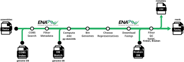

# BinBaDGer 

[](https://www.nextflow.io/)
[](https://www.docker.com/)
[](https://sylabs.io/docs/)

[[_TOC_]]

## Pipeline overview

**BinBaDGer** (**Bin**ned **Ba**cterial **D**ataset **Ge**nerato**r**) is a Nextflow DSL2 pipeline that generates a curated dataset of genomes from [AllTheBacteria](https://allthebacteria.readthedocs.io/en/latest/) (or any other [COBS](https://github.com/iqbal-lab-org/cobs)-indexed and [sketched](https://github.com/bacpop/pp-sketchlib) genome collection) based on user-defined ANI distance criteria relative to one or more reference sequences.



The pipeline runs up to seven steps:

1. **COBS search** — each reference is searched against the COBS-indexed genome database to retrieve candidate matches above a coverage threshold; candidates are ranked and selected by `--selection_method` (top, stepwise, or random).
2. **Metadata download and filtering** — ENA metadata for selected samples is downloaded with enadownloader; samples are optionally filtered by user-supplied column-level criteria (`--filter_manifest`).
3. **Sketching and ANI calculation** — Sketchlib calculates pairwise ANI distances between each reference and its candidate matches using the pre-built sketch database.
4. **ANI plotting and binning** — samples are assigned to configurable ANI distance bins; histogram, boxplot, violin and heatmap plots are generated per reference.
5. **Bin de-replication** (optional, on by default) — Sketchlib calculates within-bin pairwise ANI and a representative set is selected per bin using network-based or edge-based clustering.
6. **FASTQ download and QC** (optional) — paired FASTQs are downloaded from ENA; FastQC and Kraken2/Bracken QC is applied; only samples passing thresholds are retained (unless `--output_all_fastqs` is set).
7. **Tree building** (optional) — assemblies are extracted from xz-compressed TAR archives; a distance matrix is built with Sketchlib and a neighbour-joining tree is constructed with RapidNJ; optionally pruned with Treemmer.

## Usage

### Quickstart

#### From source code

1. Clone this repository (including submodules):

   ```bash
   git clone --recurse-submodules https://github.com/sanger-pathogens/BinBaDGer.git
   cd BinBaDGer
   ```

2. To run with `docker`, use the `-profile docker` option:

   ```bash
   nextflow run main.nf \
       -profile docker \
       --manifest manifest.csv \
       --cobs_base /path/to/cobs/indexes \
       --sketchlib_db /path/to/sketchlib/db \
       --outdir my_output
   ```

   Other profiles are also supported (`singularity`).  
   :warning: If no profile is specified the pipeline will run with the Sanger HPC-specific configuration.

3. Once the run has finished, clean up intermediate files:

   ```bash
   rm -rf work .nextflow*
   ```

#### Using on the Sanger farm

Load Nextflow and Singularity:

```bash
module load nextflow ISG/singularity
```

The AllTheBacteria COBS indexes, Sketchlib database, and assemblies are pre-configured as defaults for `--cobs_base`, `--sketchlib_db`, and `--assembly_base`. A Kraken2 database is also available at the default path. Submit to LSF:

```bash
bsub -q oversubscribed -J binbadger \
    -R "select[mem>4000] rusage[mem=4000]" -M4000 \
    -o binbadger.%J.o -e binbadger.%J.e \
    nextflow run main.nf \
        --manifest manifest.csv \
        --outdir my_output
```

### Input

#### Manifest (`--manifest`)

A CSV file with a unique ID and path to a reference assembly for each query:

```
ID,assembly
streptococcus_pneumoniae,/path/to/reference.fa
```

#### Genome database (`--cobs_base`, `--sketchlib_db`)

The pipeline requires a COBS index directory and a pre-built Sketchlib database. For AllTheBacteria (v0.2), these are available at:

- COBS indexes: `https://ftp.ebi.ac.uk/pub/databases/AllTheBacteria/Releases/0.2/indexes/phylign/`
- Sketchlib database: `https://ftp.ebi.ac.uk/pub/databases/AllTheBacteria/Releases/0.2/indexes/sketchlib/`

On the Sanger HPC, both are pre-configured as defaults.

#### Filter manifest (`--filter_manifest`)

An optional TSV for column-level metadata filtering. Columns: `column`, `filter`, `datatype`. The `filter` value is passed to `pandas.DataFrame.query()`. Example:

```
column	filter	datatype
center_name	center_name.str.contains("Wellcome Sanger Institute", na=False)	str
read_count	"read_count > 2500000"	int
collection_date	"2012 < collection_date"	datetime
```

### Output

Results are written to `--outdir` (default: `./results`):

```
results/
  <bin_range>/                         # e.g. 0.2-0.0%, 0.5-0.2%
    <SAMPLE_ACCESSION>/
      fastqs/                          # Downloaded FASTQs (if --download_fastq)
  bins/
    <reference_ID>/
      <reference_ID>_binned.tsv        # ANI distances and bin assignments
      <reference_ID>_binning.log
  clusters/
    <reference_ID>/
      <bin>/
        representatives.txt            # Selected representative accessions
        network_iteration_*.png        # Clustering visualisation
  plots/
    <reference_ID>/
      ani_histogram.png
      ani_boxplot.png
      ani_violinplot.png
      ani_heatmap.png
  metadata_chosen_samples_<date>.csv   # Metadata for samples passing all filters
  abundance_summary/
    bracken_summary_report.tsv         # Kraken2/Bracken summary (if --download_fastq)
  <SAMPLE_ACCESSION>/                  # Per-sample QC output (if --download_fastq)
    fastqc/
    kraken2/
    bracken/
```

### Parameters

**COBS search options**

| Option | Type | Default | Description |
| --- | --- | --- | --- |
| `--manifest` | `path` | (required) | Input manifest CSV with header `ID,assembly`. |
| `--cobs_base` | `path` | `/data/pam/collections/all_the_bacteria/0.2/indexes/phylign` | Base directory for COBS index files. |
| `--cobs_threshold` | `float` | `0.8` | Coverage threshold for COBS search. |
| `--selection_method` | `string` | `top` | Candidate selection method: `top`, `stepwise`, or `random`. |
| `--index_prefix` | `string` | `""` | Restrict search to COBS indexes matching this prefix (e.g. a species name). Also restricts TAR file prefix for tree building. |
| `--number_of_cobs_matches` | `integer` | `100000` | Maximum number of COBS matches to retrieve. |

---

**Metadata options**

| Option | Type | Default | Description |
| --- | --- | --- | --- |
| `--filter_manifest` | `path` | `""` | TSV file for filtering samples on ENA metadata columns. |
| `--publish_metadata` | `boolean` | `false` | Publish the ENA metadata TSV for all selected samples. |
| `--save_pre_qc_metadata` | `boolean` | `false` | Output metadata CSV before FASTQ QC filtering (recommended when not using `--download_fastq`). |
| `--short_metacsv_name` | `boolean` | `true` | Remove full timestamp from metadata CSV filenames. |

---

**Sketching and binning options**

| Option | Type | Default | Description |
| --- | --- | --- | --- |
| `--sketchlib_db` | `path` | `/data/pam/collections/all_the_bacteria/0.2/indexes/sketchlib/atb_sketchlib_v020` | Path to the Sketchlib database. |
| `--bin_ranges` | `string` | `0.98,0.99,0.995,0.998,1` | Comma-separated bin edges as ANI similarity values (e.g. `0.98` = within 2% distance). |
| `--retain_below_bins` | `boolean` | `false` | Retain samples that fall below all bins (too distant from reference). |

---

**Bin de-replication options**

| Option | Type | Default | Description |
| --- | --- | --- | --- |
| `--dereplicate_bins` | `boolean` | `true` | De-replicate each bin to a representative set. |
| `--cluster_method` | `string` | `network_based_trim` | De-replication method: `network_based_trim` or `edge_based`. |
| `--representatives` | `integer` | `10` | Number of representatives to select per bin. |
| `--make_gif` | `boolean` | `false` | Create GIF visualisation of network trimming (network_based_trim only). |

---

**FASTQ download and QC options**

| Option | Type | Default | Description |
| --- | --- | --- | --- |
| `--download_fastq` | `boolean` | `false` | Download FASTQs from ENA and run QC for selected samples. |
| `--output_all_fastqs` | `boolean` | `false` | Output all downloaded FASTQs regardless of QC result. |
| `--kraken2_db` | `path` | `/data/pam/software/kraken2/k2_standard_16gb_20240904` | Path to Kraken2 database. |
| `--read_len` | `integer` | `null` | Expected read length (required for Bracken when `--download_fastq` is set). |
| `--genus_abundance_threshold` | `float` | `90` | Minimum top-genus abundance (%) to pass QC. |
| `--species_abundance_threshold` | `float` | `85` | Minimum top-species abundance (%) to pass QC. |
| `--classification_level` | `string` | `S` | Bracken taxonomic rank: `D`, `P`, `C`, `O`, `F`, `G`, or `S`. |

---

**Tree building options**

| Option | Type | Default | Description |
| --- | --- | --- | --- |
| `--generate_tree` | `boolean` | `false` | Build a neighbour-joining tree with RapidNJ from the selected assemblies. |
| `--assembly_base` | `path` | `/data/pam/collections/all_the_bacteria/0.2/assembly/` | Base directory of xz-compressed TAR archives containing assembly FASTAs. |
| `--trim_tree` | `boolean` | `false` | Prune the tree to `--number_of_leaves` leaves with Treemmer. |
| `--number_of_leaves` | `integer` | `10` | Number of leaves to retain when trimming. |

---

**Output options**

| Option | Type | Default | Description |
| --- | --- | --- | --- |
| `--outdir` | `path` | `./results` | Directory where results are written. |
| `--monochrome_logs` | `boolean` | `false` | Output logs in plain ASCII. |

### Advanced usage

#### Selecting samples without downloading FASTQs

By default the pipeline terminates after de-replication and outputs the binned metadata CSV. Use `--save_pre_qc_metadata true` to get a CSV of all selected samples before any FASTQ download or QC:

```bash
nextflow run main.nf \
    --manifest manifest.csv \
    --save_pre_qc_metadata true \
    --outdir my_output
```

#### Restricting to a species COBS index

Use `--index_prefix` to restrict the COBS search to a specific taxon (matching the index filename prefix):

```bash
nextflow run main.nf \
    --manifest manifest.csv \
    --index_prefix streptococcus_pneumoniae \
    --outdir my_output
```

#### Downloading FASTQs with QC

When `--download_fastq true` is set, you must also supply `--read_len` and ensure `--kraken2_db` points to an accessible database:

```bash
nextflow run main.nf \
    --manifest manifest.csv \
    --download_fastq true \
    --read_len 150 \
    --outdir my_output
```

Kraken2 databases can be downloaded from [here](https://benlangmead.github.io/aws-indexes/k2).

#### Building a phylogenetic tree

Enable tree building to reconstruct a neighbour-joining tree from the selected assemblies:

```bash
nextflow run main.nf \
    --manifest manifest.csv \
    --generate_tree true \
    --trim_tree true \
    --number_of_leaves 50 \
    --outdir my_output
```

#### Resuming and iterating

Use `-resume` to restart from Nextflow-cached intermediates. This is especially useful when adjusting filters or bin ranges:

```bash
nextflow run main.nf --manifest manifest.csv --bin_ranges 0.99,0.995,1 --outdir my_output -resume
```

### Dependencies

All software dependencies are containerised. When using `--download_fastq true` or `--generate_tree true`, the following additional resources must be accessible:

- **Kraken2 database** (`--kraken2_db`): required when `--download_fastq true`. Pre-configured on the Sanger HPC; can be downloaded externally from [here](https://benlangmead.github.io/aws-indexes/k2).
- **Assembly archives** (`--assembly_base`): required when `--generate_tree true`. AllTheBacteria assemblies are pre-configured on the Sanger HPC; external users can download from [AllTheBacteria](https://allthebacteria.readthedocs.io/en/latest/assemblies.html#downloading-assemblies).

## Software versions

| Software | Version | Image |
| --- | --- | --- |
| COBS | 0.3.0 | `quay.io/biocontainers/cobs:0.3.0--hdcf5f25_1` |
| Sketchlib | 0.1.2 | `quay.io/ssd28/experimental/pp-sketchlib-rust:0.1.2_sd28_fix` |
| RapidNJ | 2.3.2 | `quay.io/ssd28/experimental/rapidnj:2.3.2-c1` |
| Treemmer | — | `quay.io/sangerpathogens/treemmer:a3a1632` |
| Kraken2 | 2.1.3 | `quay.io/biocontainers/kraken2:2.1.3--pl5321hdcf5f25_0` |
| Bracken | 2.8 | `quay.io/biocontainers/bracken:2.8--py310h0dbaff4_1` |
| FastQC | 0.12.1 | `quay.io/biocontainers/fastqc:0.12.1--hdfd78af_0` |
| enadownloader | v2.3.3 | `quay.io/sangerpathogens/enadownloader:v2.3.3-903be379` |

See `modules/` and `assorted-sub-workflows/` for pinned container versions.

## Troubleshooting

- **COBS search returns too few matches**: lower `--cobs_threshold`, increase `--number_of_cobs_matches`, or remove `--index_prefix` to search all indexes. Use `-resume` after changing these parameters.
- **Bracken QC fails**: ensure `--read_len` is set and `--kraken2_db` points to a valid database. Kraken2 databases can be downloaded from [here](https://benlangmead.github.io/aws-indexes/k2).
- **Tree building fails**: ensure `--assembly_base` points to a directory of xz-compressed TAR archives using ENA sample accessions, and that `--index_prefix` matches the archive filename prefixes if set.
- **Resuming a failed run**: add `-resume` to restart from cached intermediate results.
- For further help, check `.nextflow.log` and the per-process logs in the `work/` directory.

## Issues and Contributions

If you find an issue with this pipeline, or would like to suggest an improvement, please log an issue or open a pull request on this repository.

If you are at Sanger and need internal support, you can raise an issue on the PAM Freshservice portal: https://sanger.freshservice.com/support/catalog/items/426
